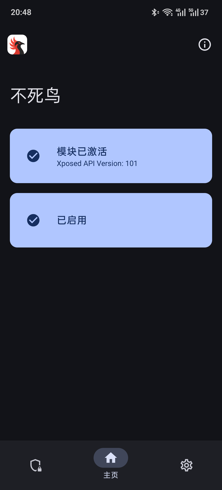
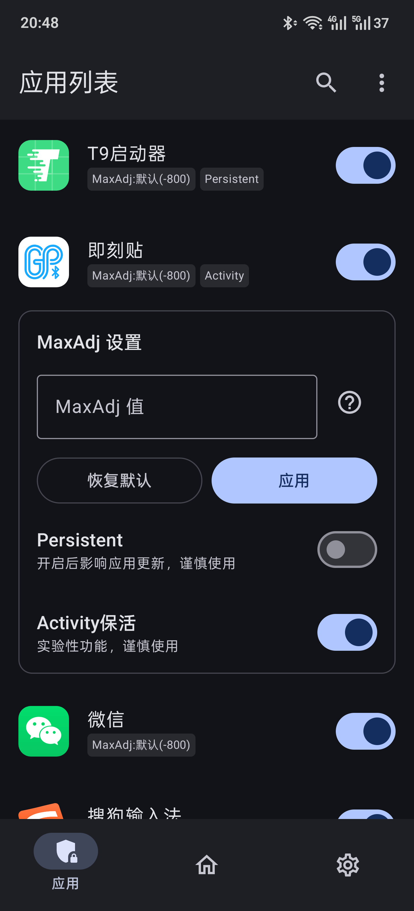
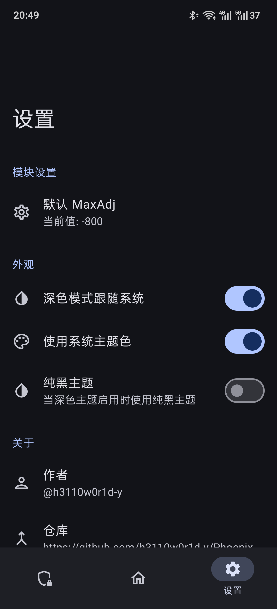

  
  <h1>不死鸟 (Phoenix)</h1>

---

## 项目简介

基于 Xposed，Hook 系统框架的进程创建函数，修改进程的 MaxOomAdj 实现应用进程保活。

理论上支持 Android 8+，Hook 位置：[Hook.kt](./app/src/main/java/com/h3110w0r1d/phoenix/Hook.kt)，仅在 Android 15~16 上测试可用，其他版本谨慎使用。

## 下载模块

  - [Latest Release](https://github.com/h3110w0r1d-y/Phoenix/releases/latest)

## 使用说明

  - 进入 LSPosed 启用模块，仅勾选`系统框架`，重启系统使模块生效
  - 打开模块，勾选需要保活的应用（Android 10+ 实时生效，无需重启系统/应用; Android 10 以下重启应用生效）

## 应用截图

    
点击展开截图

    
    
    

## ❤️赞助者

| [ @Jie0746 (ByChum)](https://github.com/Jie0746) |
| :--: |

## 画饼

  - [x] 配置默认MaxAdj
  - [x] 为应用配置不同MaxAdj
  - [x] 支持开启Persistent
  - [x] 保活Activity (Android 11+)
  - [ ] 保活Service

如有建议或问题欢迎提交 Issue 反馈或加群交流1083682874。

## 打赏

    
点击展开二维码

    
    

